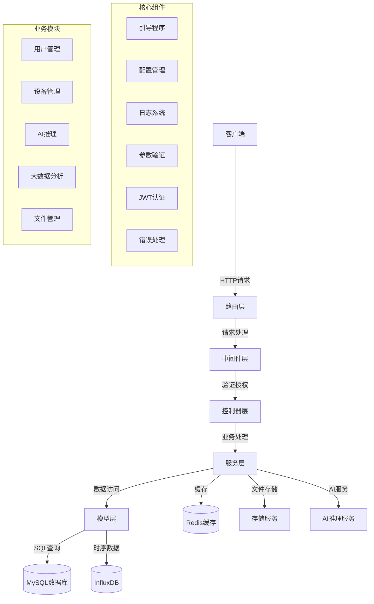

# IoTA Web服务器

## 项目介绍
IoTA Web服务器是一个基于Go语言和Gin框架开发的物联网应用后端服务，支持用户管理、设备管理、AI推理、大数据分析等功能。

## 系统架构

### 架构图



## 技术栈

- **Web框架**: Gin
- **ORM框架**: GORM v2
- **数据库**: MySQL、InfluxDB(时序数据库)
- **缓存**: Redis
- **认证**: JWT
- **配置管理**: Viper
- **日志**: Zap + Lumberjack
- **参数验证**: validator v10

## 项目结构

```
IoTA_WebServer/
├── app/                     # 应用核心代码
│   ├── aop/                 # 面向切面编程
│   ├── core/                # 核心功能
│   ├── global/              # 全局变量和常量
│   ├── http/                # HTTP相关
│   │   ├── middleware/      # 中间件
│   │   └── validator/       # 请求参数验证
│   ├── model/               # 数据模型
│   ├── service/             # 业务服务
│   └── utils/               # 工具函数
├── bootstrap/               # 应用引导程序
├── cmd/                     # 应用入口
│   └── web/                 # Web服务入口
├── config/                  # 配置文件
├── public/                  # 公共资源
├── routers/                 # 路由定义
└── storage/                 # 存储目录
    ├── app/                 # 应用存储
    └── logs/                # 日志存储
```

## 系统组件详细说明

### 1. 引导程序(Bootstrap)

项目启动时，`bootstrap/init.go`初始化所有必要的组件：
- 检查必要的目录和文件
- 初始化配置
- 设置日志系统
- 初始化数据库连接
- 注册验证器
- 初始化雪花算法ID生成器

### 2. 路由系统(Routers)

路由系统定义在`routers/web.go`中，主要包含以下路由组：
- 无需认证的公共路由(如登录、验证码)
- 需要认证的普通用户路由
- 超级管理员路由
- AI相关路由
- 大数据分析路由
- 文件上传路由

### 3. 中间件(Middleware)

中间件提供关键的横切功能：
- 跨域(CORS)支持
- JWT认证
- 超级管理员鉴权
- 日志记录

### 4. 数据模型(Model)

项目使用GORM v2作为ORM框架，连接多种数据库：
- MySQL: 存储用户、设备等基本信息
- InfluxDB: 存储时序数据，如设备监控数据

主要模型包括：
- 用户模型(users.go)
- AI相关模型(ai.go)
- 大数据分析模型(bigdata.go)
- 时序数据模型(influxdb.go)

每个模型都继承自`BaseModel`，提供基本的CRUD操作。

### 5. 服务层(Service)

服务层包含核心业务逻辑：
- 用户服务: 登录、注册、权限管理
- 文件上传服务: 处理文件上传和存储
- 服务器信息: 监控服务器状态
- 系统日志: 记录系统运行日志

### 6. AI功能模块

AI功能模块支持以下特性：
- 农业专家AI推理
- 检测信息和图片分析
- 病虫害防治建议
- AI监控日志

### 7. 大数据分析模块

大数据模块提供数据分析功能：
- AE(农业环境)数据分析
- AS(农业系统)数据分析
- 设备信息分析
- 内存和CPU使用情况监控

### 8. 配置管理

使用Viper管理配置，支持配置热更新，主要配置文件：
- config.yml: 应用全局配置
- gorm_v2.yml: 数据库配置

### 9. 安全性

- JWT认证: 管理用户会话和访问权限
- 参数验证: 所有输入参数经过严格验证
- 超级管理员鉴权: 特权操作需要额外的权限验证

## 部署说明

1. 确保已安装Go 1.23.0或更高版本
2. 配置MySQL和InfluxDB数据库
3. 配置Redis缓存服务
4. 修改`config/config.yml`和`config/gorm_v2.yml`中的相关配置
5. 编译项目: `make build`
6. 运行服务: `./IoTA_WebServer`

## 配置说明

### 主要配置参数

- **AppDebug**: 是否为调试模式
- **HttpServer.Web.Port**: Web服务器端口
- **Token**: JWT认证相关配置
- **Redis**: Redis连接配置
- **InfluxDB**: InfluxDB连接配置
- **AI**: AI服务配置
- **FileUploadSetting**: 文件上传配置

## 项目特点

1. **分层架构**: 清晰的分层设计，便于维护和扩展
2. **全面的API**: 提供丰富的RESTful API接口
3. **完善的认证机制**: 基于JWT的安全认证
4. **AI集成**: 集成AI推理能力，支持智能农业应用
5. **高性能**: 基于Gin和GORM的高性能后端架构
6. **可扩展性**: 模块化设计，易于扩展新功能 